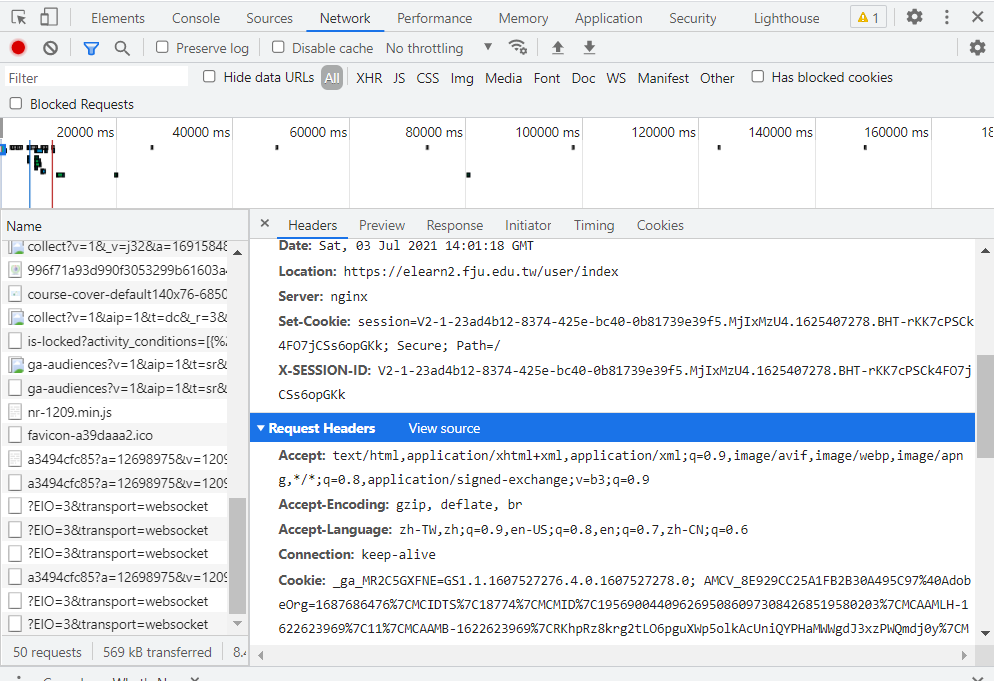

# Tronclass 助教上傳成績工具
* 原作者文章：https://zhuanlan.zhihu.com/p/112969148
* 我沒利用到上傳批改過後的作業功能，下文不會提到，詳細請看原文。
* `setgrade.py`  設定
	* `host_url`: tronclass 首頁網址。
	* `_data`: `score_list.csv` 檔案位置。
	* `course_id`: 課程 ID，利用網頁版 Tronclass，進入該課程，從上方網址列獲得。
	* `homework_id`: 作業 ID，利用網頁版 Tronclass，進入該作業，從上方網址列獲得。
	* `cookie`: 以 google 為例，開啟開發者工具 -> `Network`，進入 Tronclass 網站，點選其中一個資源，在 `header` 中的 `Request Headers`，可以找到 `cookie`。
		* `cookie` 每隔一段時間就會更新。
		* 
* `score_list.csv` 設定
	* 第一直行：學號
	* 第二直行：姓名
	* 第三直行：成績
	* 學號和姓名可直接從 Tronclass 課程內的 `教學成果->成績` 匯出。
	* 用 excel 儲存可能會遇到編碼問題，建議直接用問文字編輯器儲存。
* Tronclass 設定
	* 要把所有要上傳成績的學生勾選為已繳，否則無法上傳。